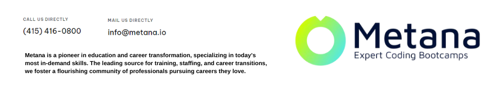

### **Metana empowers aspiring developers with immersive, hands-on training in Full Stack and Web3 technologies. Through practical projects, expert mentorship, and dedicated career guidance, we help you land high-demand tech roles and build a future-proof career.**

## 🚀 Bootcamp Offerings  

### **1. Full Stack Development Bootcamp (4 Months)**  
> A streamlined program designed for professionals eager to build robust web applications and transition into tech roles seamlessly.
  
#### **Key Features**:
- **Topics Covered**:  
  HTML, CSS, JavaScript, React, Node.js, Database Design, API Development, and Deployment.  
- **Flexible Schedules**: Perfect for working professionals balancing multiple commitments.  
- **Real-World Projects**: Build and deploy production-ready web applications.  
- **Career Success**: Tailored guidance and job placement support via **Metana's JobCamp™️**.

<h3 align="left">Connect with me:</h3>

👉 **[Learn More →](https://metana.io/full-stack-software-engineer-bootcamp/)**  
 
 

         

### **2. Web3 Solidity Bootcamp (4 Months)**  
> Dive into blockchain development and learn to build decentralized applications (dApps) that power the future of technology.

#### **Key Features**:
- **Topics Covered**:  
  Solidity, Smart Contract Security, ERC Standards, IPFS, Hardhat, Gas Optimization, and Chainlink.  
- **Portfolio-Driven Learning**: Create and showcase real-world decentralized applications.  
- **One-on-One Mentorship**: Weekly sessions with blockchain experts.  
- **Job Placement**: Comprehensive support to secure your dream role in Web3.  

👉 **[Learn More →](https://metana.io/web3-solidity-bootcamp-ethereum-blockchain/)**  
 
 

### **3. Full Stack Web3 Beginner Bootcamp (8 Months)**  
> From novice to expert—this program is tailored for complete beginners looking to master both Web2 and Web3 development.

#### **Key Features**:
- **Structure**:  
  3 months of Full Stack fundamentals, followed by 5 months of advanced Web3 development.  
- **Topics Covered**:  
  Front-End and Back-End Web Development, Advanced Solidity, Blockchain Integrations, and UI/UX Design.  
- **Hands-On Experience**: Build projects that combine Web2 and Web3 technologies seamlessly.  
- **Career Boost**: Job placement assistance to kickstart your tech career.  

👉 **[Learn More →](https://metana.io/web3-beginner-bootcamp/)**  
 
 

## 💼 **Metana's JobCamp™️**  
> Unlock your career potential with **JobCamp™️**—a dedicated program for job preparation, networking, and career growth.  

### **What We Offer**:
- Resume and portfolio building tailored for tech roles.  
- Mock interviews and technical assessments.  
- Networking opportunities with leading companies.  

👉 **[Learn More →](https://metana.io/jobcamp/)**  
 

---

## 🌟 Why Choose Metana?  
- **Expert Mentorship**: Weekly personalized coaching sessions with seasoned professionals.  
- **Collaborative Learning**: Small, focused cohorts to foster growth and teamwork.  
- **Real-World Skills**: 80% of our curriculum involves practical, project-based training.  
- **Global Network**: Join a community of tech enthusiasts and industry leaders.
 

---

## 🤝 Join Our Community  
Be part of a thriving community of learners, mentors, and industry experts.  

  
 

---

## 🎯 Take the First Step Today!  
Your dream tech career is just a click away. Apply now and begin your journey with Metana.

 
 

 
 

---
